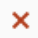
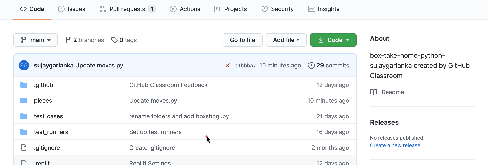
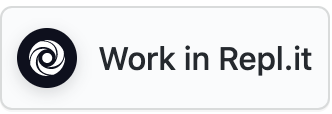
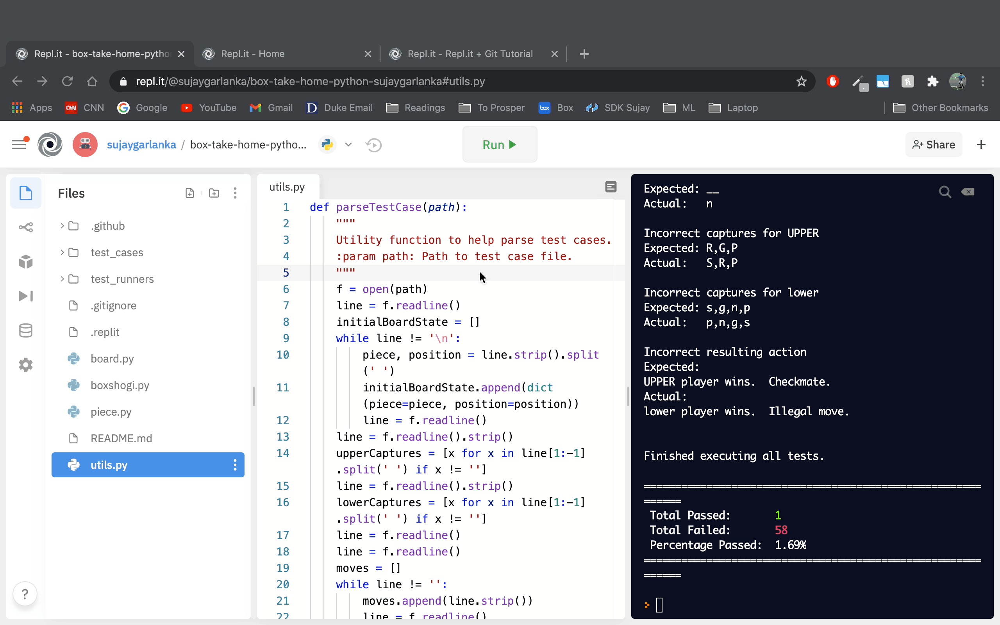
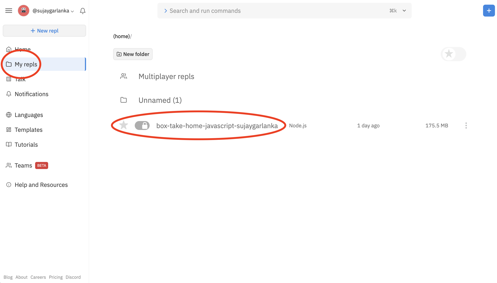

# BoxShogi Specification

We're excited for you to get started on this take home assignment! Below you will find all the information needed to get set up and start coding away! Throughout the two weeks we will invite you to office hours. These are a great way for you to learn more about the assignment as well as Box, and get your questions answered directly from our engineers. You will be invited to four virtual office hours (look out for Google Calendar invites and a Zoom link!) More details can be found [here](https://cloud.box.com/s/dbblapdi6r1s35ogd364vjxoenvr17or). 

Please feel free to reach out anytime to our team at internship-take-home@box.com, whether you have questions/concerns about the assignment or just want to learn more about Box.

Listed below is how to setup your coding environment and begin coding under [Getting Started](#getting-started), the game specification under [Game Rules](#game-rules) and finally the expected game interface under [Game Interface](#game-interface). We recommend reading the games rules and understanding the game interface before you begin coding.

- [Getting Started](#getting-started)
  - [Working on your Desktop](#working-on-your-desktop)
  - [Working Online with Repl.it (Beta)](#working-on-repl-beta)
- [Game Rules](#game-rules)
    - [Overview](#overview)
    - [Objective](#objective)
    - [The Players](#the-players)
    - [The Pieces](#the-pieces)
    - [The Board](#the-board)
    - [Capturing](#capturing)
    - [Promotion](#promotion)
    - [Drops](#drops)
    - [Game End](#game-end)
- [Game Interface](#game-interface)
  - [Interactive Mode](#interactive-mode)
  - [File Mode](#file-mode)

## Getting Started

When you accepted the assignment, this Github repo was created. This is where your assignment code will reside. This is what will be viewed and graded by us. Anytime code is pushed to this repo our autograder is run. **You will ultimately be graded on passing the tests run by the autograder. This is stricter than the local test runner we provide. So passing the tests locally doesn't guarantee passing the autograder.** You can view the autograder results by clicking on the ,  or  next to the most recent commit hash. You must add a commit before you see this. This is shown below.



Some starter code is provided and a utility function. **You must use the starter code provided! Please keep the directory structure for the starter code so our autograder can find the main method to run.** You can also use the utility function provided to handle some of the tedious input and output so that you don't need to implement it yourself. The utility function can be modified to suit your needs. It is also optional; not required to be used.

You can work on this project locally on your desktop or online on Repl.it.

### Working on your Desktop

To begin the assignment, you need to first clone your repo to your desktop by running the command below in your terminal after replacing `<your-github-username>`  with your Github username. 

```
$ git clone https://github.com/Box-Internship-Assignment/box-take-home-python-<your-github-username>.git
```

Once you have the code locally, you can edit your code using your favorite code editor. Once you have edited the code, to push the changes to Github, you should run the commands below. 

```
$ git add .
$ git commit -m 'message describing the changes'
$ git push
```

#### Testing your program

We have created a collection of test cases along with a test runner that you can use to determine the correctness of your solution. We will also use the test runner when evaluating your program.

The test runner is provided as a binary, and supports macOS, Windows 10, and Ubuntu Linux. Other flavors of these operating systems may work, but are not tested.

The test runner and test cases can be found in the `test_runners` and `test_cases` folder respectively.

##### Running the test runner
- To invoke the test runner, navigate to this repo in your terminal and execute the version for your operating system from the project root directory. e.g. `./test_runners/test-runner-mac`, or on Windows, `cmd /K ./test_runners/test-runner-windows.exe`
- **Notes**
  - On windows, pass the `/K` option to keep the runner open after execution
  - Make sure the runner is executable via the terminal by running `chmod a+x ./test_runners/test-runner-mac` or `chmod a+x ./test_runners/test-runner-linux`. On Windows, right click the file and navigate the `properties` menu

##### Supported flags
`-r` reset: this resets the `.command` file in case the path/way you run your program in file mode changes.

`-v` verbose: this will print out the difference in the expected output and actual output of failed tests, along with an explanation of the differences/errors.

`-f` filter: filters test cases based on a string. e.g. `./test_runners/test-runner-mac -f "governance"` will run tests that have governance in their name.  
    **Note:** If using windows, make sure to use double quotes "" or no quotes. Single quotes will not work.  
    
`-b` break: stops execution of tests after the first encountered failure

**Note:** You can combine flags, although if you're using the filter flag, the filter string must be right after. For example, both of these would work equivalently:
- `./test_runners/test-runner-mac -b -f 'governance'`
- `./test_runners/test-runner-mac -f 'governance' -b`

Note: the test cases aren't completely exhaustive — there are too many variations of illegal moves for creating a totally exhaustive set to be feasible — but for the purposes of evaluating your solution, you don't need to consider anything not covered by the provided test cases.

### Working on Repl (Beta)

Repl.it is an online coding environment where you can write code and run tests. 

This year we are including an option to code this project online on Repl.it. This is **beta** program because this is new for us as well as Repl and Github. You can follow the steps below to setup Repl.it and push your code to Github. We also welcome any questions or feedback you may have regarding this option at internship-take-home@box.com.

**For more detailed setup instructions, FAQ's and common issues than what is below, view the box note https://cloud.box.com/s/bia73zsj70zwrlalvl7la9yup6qpglyr**.

#### Create/Sign into a Repl.it Account
- Go to Repl's sign up [page](https://repl.it/signup) and sign up if don't you have an account or login if you already have one linked to your Github
- You **must** create an account using your Github login

#### Setup Repl.it
- Open this link https://classroom.github.com/a/ZLSMcNsc in a new tab 
- Then click on the  button in the assignment page you just opened. You will be redirected to your repo in Repl.
- Once redirected, you can write code and run tests.
- Tests can be run by pressing the green `Run` button at the top of REPL. If the button doesn't show up, refresh the page.
- **Common Issues**
    - **Not redirected to your Repl** - You must be logged into Repl in the browser you use to open your repo
    - View FAQs and issues here https://cloud.box.com/s/bia73zsj70zwrlalvl7la9yup6qpglyr


#### Push code from Repl.it to Github
Once you have made your changes in Repl.it, you should push the changes to Github. The steps to do so are the following and are shown in the GIF below:
- Click on the  icon in the right navigation bar
- Type in the commit message in the commit text box
- Then click `Commit & push ->` button to push the changes to Github



#### Access Repl.it in the future
To access your code in Repl after setting up, you can **login** to Repl, click on **My repls**, and click on your project as shown below



## Game Rules

### Overview

BoxShogi is a variant of Japanese chess played on a 5x5 board between two players. Over the next two weeks, you will be building a simplified version of this game. The pieces from the original game have been modified to represent various Box products.

### Objective

The game has two players, **lower** and **UPPER**. Each player aims to capture their opponent's main piece (Box Drive).

### The Players

The  **lower** player starts on the bottom side of the board, and their pieces are represented by lower-case characters.

The **UPPER** player starts on the top side of the board, and their
pieces are represented by upper-case characters.

The  **lower** player always moves first.

### The Pieces

Each player starts with six pieces, each with different movement capabilities.

The **[Box Drive](https://www.box.com/drive) (d/D)** piece, king in the original game, can move one square in any direction:


The **[Box Notes](https://www.box.com/notes) (n/N)** piece, rook in the original game, can move any number of squares along rows or columns (orthogonal directions):


The **[Box Governance](https://www.box.com/security/governance-and-compliance) (g/G) piece** piece, bishop in the original game, can move any number of squares along diagonal directions:


The **[Box Shield](https://www.box.com/shield) (s/S)** piece, gold general in the original game, can move one square in any direction except its backward diagonals:


The **[Box Relay](https://www.box.com/collaboration/relay-workflow) (r/R)** piece, silver general in the original game, can move one square in any direction except sideways or directly backward:


A **[Box Preview](https://community.box.com/t5/Migrating-and-Previewing-Content/Preview/ta-p/19153) (p/P)** piece, pawn in the original game, can move one space forward:


*Note: The Box Notes piece or the Box Governance piece cannot jump over pieces in its path of movement.*

### The Board

The board is a grid of 5 rows by 5 columns. We will call each location on the board a *square*.


This is the starting board state:


And, this is the grid representation of the starting board state:
```
5 | N| G| R| S| D|
4 |__|__|__|__| P|
3 |__|__|__|__|__|
2 | p|__|__|__|__|
1 | d| s| r| g| n|
    a  b  c  d  e
```

We read the board via a combination of the letters on the x-axis and numbers on the y-axis. For instance, piece *p* is at location *a2* while piece *P* is at location *e4*.

### Capturing

A player can capture an opponent's piece by moving their piece onto the same square as an opponent's piece. The captured piece leaves the board, and can be later dropped onto the board by the player who captured it (more on this under *Drops* below). A player cannot capture their own pieces (this is an illegal move).

### Promotion

A piece may (but does not have to) be **promoted** when it moves into, within, or out of the **promotion zone**.

The promotion zone is the row of the board furthest from each player's starting position:
* For the lower player, the promotion zone is the top row of the board.
* For the UPPER player, the promotion zone is the bottom row of the board.


A piece that has been promoted should gain a plus symbol "+" before its letter showing on the board.

Pieces promote as follows:
* The **Box Drive** piece cannot be promoted.
* The **Box Shield** piece cannot be promoted.
* The **Promoted Box Relay** piece (+r/+R) moves the same way as the **Box Shield** piece.
* The **Promoted Box Governance** (+g/+G) piece can move like the **Box Governance** piece or the **Box Drive** piece.
* The **Promoted Box Notes** piece (+n/+N) can move like the **Box Notes** piece or the **Box Drive** piece.
* The **Promoted Box Preview** piece (+p/+P) moves like the **Box Shield** piece.

*Note: The Box Preview pieces **must** be promoted once they reach the furthest row (otherwise they would not have any legal moves on the next turn).*

### Drops

Pieces that a player has captured can be dropped back onto the board under the capturing player's control. Dropping a piece takes your entire turn.

You cannot drop a piece onto a square that contains another piece.

All dropped pieces must start unpromoted (even if they were captured as promoted pieces and/or are dropped into the promotion zone).

The Box Preview piece may not be dropped into the promotion zone or onto a square that results in an immediate checkmate.
* Note: other pieces *can* be dropped into the promotion zone or onto a square that results in an immediate checkmate.

Two unpromoted Box Preview pieces may not lie in the same column when they belong to the same player (e.g. If you already have a Box Preview piece in the third column, you cannot drop another Box Preview piece into that column).

### Game End

#### Move Limit

For simplicity, the game ends in a tie once each player has made 200 moves. When a game ends in a tie, output the message "Tie game.  Too many moves." instead of the move prompt.

#### Checkmate

When a player is in a position where their Box Drive piece could be captured on their opponent's next move, they are in **check**.
That player **must** make a move to get out of check by doing one of the following:
* remove their Box Drive piece from danger
* capture the piece that threatens their Box Drive piece
* put another piece between the Box Drive piece and the piece that threatens it

If a player has no moves that they could make to avoid capture, they are in **checkmate** and lose the game.

When a player wins via checkmate, output the message "<UPPER/lower> player wins.  Checkmate." instead of the move prompt.

#### Illegal Moves

If a player makes a move that is not legal, the game ends immediately and the other player wins. When a player loses via an illegal move, output the message "<UPPER/lower> player wins.  Illegal move." instead of the move prompt.

## Game Interface

Your program should accept command line flags to determine which mode to play in:
```
$ python3 boxshogi -i
```
In **interactive mode**, two players enter keyboard commands to play moves against each other.

```
$ python3 boxshogi -f <filePath>
```
In **file mode**, the specified file is read to determine the game state and which moves to make.

### Interactive Mode

#### Output

At the beginning of each turn, your program should output the following:
1. The current board state, using the utility function provided to generate the text representation of the board
2. An empty line
3. The space-separated list of pieces captured by **UPPER** (in the order that they were captured)
4. The space-separated list of pieces captured by **lower** (in the order that they were captured)
5. An empty line
6. An input prompt for the next player to enter their move, followed by a space

For example, this is how a game would begin:
```
$ python3 boxshogi -i
5 | N| G| R| S| D|
4 |__|__|__|__| P|
3 |__|__|__|__|__|
2 | p|__|__|__|__|
1 | d| s| r| g| n|
    a  b  c  d  e

Captures UPPER:
Captures lower:

lower>
```

**NOTE:** You should use the provided starter code to get the string representation of the board state.

#### Move Format

The **lower** player would then enter a move using the following formats:

**move <from> <to> [promote]**
To move a piece, enter `move` followed by the location of the piece to be moved, the location to move to, and (optionally) the word `promote` if the piece should be promoted at the end of the turn.
* `move a2 a3` moves the piece at square a2 to square a3.
* `move a4 a5 promote` moves the piece at square a4 to square a5 and promotes it at the end of the turn.

**drop <piece> <to>**
To drop a piece, enter `drop` followed by the lowercase character representing the piece to drop and the location to drop the piece.  Pieces are always lower-case, no matter which player is performing the drop.
* `drop s c3` drops a captured **Box Shield** piece at square c3.
* `drop g a1` drops a captured **Box Governance** piece at square a1.

Once a player enters their move, your program should display the move made, update the game state, and proceed to the next turn. For example:
```
lower> move b1 b2
lower player action: move b1 b2
5 | N| G| R| S| D|
4 |__|__|__|__| P|
3 |__|__|__|__|__|
2 | p| s|__|__|__|
1 | d|__| r| g| n|
    a  b  c  d  e

Captures UPPER:
Captures lower:

UPPER> move a5 a2
UPPER player action: move a5 a2
5 |__| G| R| S| D|
4 |__|__|__|__| P|
3 |__|__|__|__|__|
2 | N| s|__|__|__|
1 | d|__| r| g| n|
    a  b  c  d  e

Captures UPPER: P
Captures lower:

lower>
```

#### Check Detection

Before a player's turn, you should also determine if they are in check. If so, output a line stating that they are in check, and output all available moves for them to get out of check (one move per line):
```
5 |__|__|__| D|__|
4 |__|__|__|__|__|
3 |__|__|__|__|__|
2 |__| S|__|__|__|
1 | d|__|__|__|__|
    a  b  c  d  e

Captures UPPER: N G S R P
Captures lower: g p r n

lower player is in check!
Available moves:
move a1 b2
lower>
```

If a player is in check and performs an action which is not one of the outputted available moves out of check, we consider it an illegal move. Also, moving oneself into check is considered an illegal move.

*Note: If your moves out of check are a different ordering than the test case output, alphabetizing the moves should result in the same ordering as expected test output.*

#### Game End

When the game ends, output which player won and the reason they won. Examples:
* UPPER player wins.  Checkmate.
* lower player wins.  Illegal move.
* Tie game.  Too many moves.

### File Mode

**File mode** is very similar to **interactive mode**, except the input can be a partial game.

The input file will contain:
* each piece's current position
* an array of pieces captured by UPPER
* an array of pieces captured by lower
* moves to make with one move per line

Your program should output the board state after the list of moves have been made, or immediately if one player wins in the middle of the input.

File mode will be used by a provided test runner to compare your output against the expected output. (See [Testing your program](#testing-your-program))

Running the test cases manually is not required, but can be helpful when starting file mode.
If you'd like to run a test case individually outside of the test runner:
1. use the .in files as the inputs to file mode
2. compare the output to the corresponding .out file.  

For example, using the `diff` tool on a Python solution:

```
$ python boxshogi -f ./test_cases/initialMove.in | diff -u ./test_cases/initialMove.out -
```

For example, this file begins in the middle of a game and does not complete the game:
```
d a1
s b1
r c1
g d1
n e1
p a2
D e5
S d5
R c5
G b5
N a5
P e4

[]
[]

move a2 a3
```

**NOTE:** You should use the provided utility function `parseTestCase()` to read in the test case.  This function will read in the file for you and produce an object with the relevant information.

The expected output is the same output as **interactive mode** after the last move is made:
```
UPPER player action: move e4 e3
5 | N| G| R| S| D|
4 |__|__|__|__|__|
3 | p|__|__|__| P|
2 |__|__|__|__|__|
1 | d| s| r| g| n|
    a  b  c  d  e

Captures UPPER:
Captures lower:

lower>
```

In the following example, the game ends after the third move and your program does not need to read the last move.

Input:
```
d a1
D e5

[]
[]

move a1 a2
move e5 e4
move a2 e4
move e4 e5
```

Expected output:
```
lower player action: move a2 e4
5 |__|__|__|__|__|
4 |__|__|__|__| D|
3 |__|__|__|__|__|
2 | d|__|__|__|__|
1 |__|__|__|__|__|
    a  b  c  d  e

Captures UPPER:
Captures lower:

UPPER player wins.  Illegal move.
```

